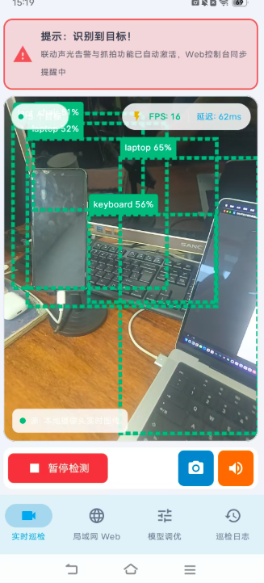
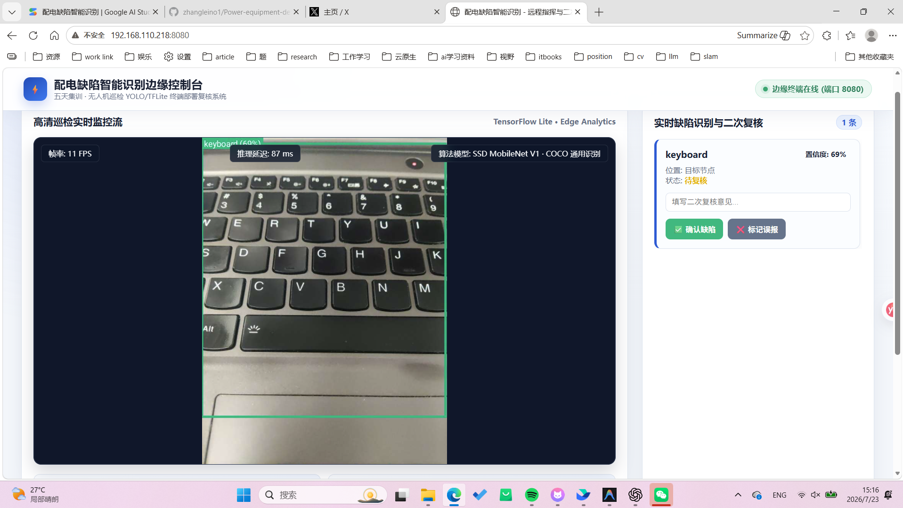

# 配电缺陷智能识别

一套运行在 Android 手机上的端侧目标识别与巡检系统。项目使用 TensorFlow
Lite 在手机本地处理摄像头画面，并通过局域网向 PC 提供实时监看、巡检记录
和二次复核界面。

<!-- prettier-ignore -->
> [!IMPORTANT]
> 当前版本内置 SSD MobileNet V1 通用目标检测模型，适合验证完整检测流程。
> 自训练模型导入口只兼容 TensorFlow Lite Task Vision 所需的 Metadata 和
> 输出定义。Ultralytics 直接导出的 LiteRT 模型仍需要 YOLO 专用解析器。


## 界面预览

下面展示手机实时巡检页和局域网 PC 控制台的当前界面。





## 核心功能

工程把端侧检测、记录留痕和局域网复核组合成一条演示闭环。

| 功能 | 说明 |
| --- | --- |
| 手机实时检测 | 使用 CameraX 获取画面，在端侧执行目标检测并绘制识别框 |
| 通用目标模型 | 内置 `mobilenet_ssd.tflite`，对应 SSD MobileNet V1 |
| 自定义模型入口 | 可从设置页面导入自训练 YOLO `.tflite` 文件 |
| 推理参数设置 | 置信度阈值实时生效；CPU 4 线程已接入，GPU 和 NPU 显示为待接入 |
| PC 局域网控制台 | 手机内置 Web 服务，提供实时画面、状态、历史记录和复核操作 |
| 巡检记录 | 使用 Room 保存检测结果、位置、时间和复核状态 |
| 一键打包安装 | Windows 下提供 `打包.bat` 和 `安装.bat` |

## 当前模型

项目只保留一个内置通用模型：

| 项目 | 内容 |
| --- | --- |
| 模型 | SSD MobileNet V1 |
| 文件 | `app/src/main/assets/mobilenet_ssd.tflite` |
| 用途 | COCO 类别的通用目标检测 |
| 状态 | 内置可用 |

该模型用于验证摄像头、TensorFlow Lite 推理、结果绘制、记录保存和 Web 展示的完整链路，不是专门训练的电力缺陷模型。

## 快速开始

先完成本机 Android 构建环境，再选择批处理脚本或 Gradle 命令。

### 环境要求

构建和运行工程需要以下环境。

- Android 7.0（API 24）或更高版本的手机
- Android SDK，项目编译目标为 Android SDK 36.1
- JDK 17，用于普通构建
- Java 21 或更高版本，用于运行 Android SDK 36 的 Robolectric 单元测试
- 手机与访问控制台的 PC 位于同一局域网

### Windows 一键构建

在项目根目录双击：

```text
打包.bat
```

脚本会检查 Java、Gradle Wrapper 和 APK 输出，并生成：

```text
app/build/outputs/apk/debug/app-debug.apk
```

首次构建会由 Gradle Wrapper 下载 Gradle 9.3.1。

### 安装到手机

开启手机的开发者选项和 USB 调试，然后双击：

```text
安装.bat
```

如果同时连接多台设备，可以传入设备序列号：

```bat
安装.bat emulator-5554
```

脚本会从 `PATH`、`ANDROID_SDK_ROOT`、`ANDROID_HOME` 或 `local.properties` 查找 ADB。

### 使用 Gradle 命令构建

Windows：

```powershell
.\gradlew.bat assembleDebug
```

macOS 或 Linux：

```bash
./gradlew assembleDebug
```

## 使用方法

安装应用后，先验证手机端检测，再按需打开局域网控制台。

### 手机端实时巡检

按下面的顺序启动摄像头和检测流程。

1. 安装并启动应用。
2. 授予相机权限。
3. 在“实时巡检”页面开始检测。
4. 在“模型调优”页面调整置信度和推理设备。
5. 在“巡检日志”页面查看或复核历史记录。

### PC 端控制台

PC 控制台从手机内置 Web 服务读取实时状态和巡检记录。

应用启动后会在手机上启动局域网 Web 服务。确保手机和 PC 位于同一网络，然后在 PC 浏览器访问：

```text
http://手机IP:8080
```

手机端“局域网 Web”页面会显示实际访问地址。PC 控制台支持查看实时画面、推理状态、目标列表、历史记录和复核信息。

## 导入自训练 YOLO 模型

当前导入入口执行 Task Vision 兼容性校验，不包含 Ultralytics YOLO 专用解析。

1. 将训练完成的模型转换为 TensorFlow Lite `.tflite` 文件。
2. 在应用的“模型调优”页面选择“自训练 YOLO 电力缺陷模型”。
3. 通过文件选择器导入模型。
4. 模型加载成功后，应用会切换到自定义模型；加载失败时会返回内置 MobileNet 模型并显示原因。

导入模型必须兼容 TensorFlow Lite Task Vision `ObjectDetector`，并包含它需要的
模型 Metadata、标签和检测输出定义。原始 Ultralytics YOLO LiteRT 导出文件
通常不能直接加载，必须增加 YOLO 输入预处理、输出解析、NMS 和坐标还原适配器。

<!-- prettier-ignore -->
> [!CAUTION]
> 文件选择器接受 `.tflite` 只代表扩展名正确，不代表模型接口兼容。导入失败
> 时应用会回退到内置 MobileNet，并显示加载原因。

## 技术栈

工程使用以下主要框架和库。

- Kotlin
- Jetpack Compose
- CameraX
- TensorFlow Lite 与 TensorFlow Lite Task Vision
- Room
- Kotlin Coroutines
- NanoHTTPD
- Gradle Wrapper 9.3.1

## 项目结构

核心代码按数据、推理、UI 和 Web 服务分层。

```text
.
├─ app/src/main/assets/                  # 内置 TFLite 模型
├─ app/src/main/java/com/example/
│  ├─ data/                              # Room 数据库与巡检记录
│  ├─ tflite/                            # 模型配置与推理引擎
│  ├─ ui/                                # ViewModel、手机页面和主题
│  └─ web/                               # PC 控制台与局域网接口
├─ app/src/test/                         # Android 本地单元测试
├─ gradle/wrapper/                       # Gradle Wrapper
├─ tests/BatchScripts.Tests.ps1          # 打包和安装脚本回归测试
├─ 打包.bat
└─ 安装.bat
```

## 测试

先运行快速单元测试，再构建 Debug APK。

批处理脚本回归测试：

```powershell
powershell.exe -NoProfile -ExecutionPolicy Bypass -File .\tests\BatchScripts.Tests.ps1
```

Android Debug 单元测试需要 Java 21 或更高版本：

```powershell
.\gradlew.bat testDebugUnitTest
```

构建 Debug APK：

```powershell
.\gradlew.bat assembleDebug
```

## 后续计划

下面的工作属于后续完整 YOLO Android 部署范围。

- 微调并接入面向电力设备缺陷的 YOLO 模型
- 为常见 YOLO TFLite 输出格式增加专用后处理适配器
- 补充真实手机端和 PC 控制台截图
- 增加更多真实设备上的推理性能与稳定性测试

## 注意事项

课堂和现场演示需要遵守以下限制。

- 通用 MobileNet 模型的识别结果不能作为电力缺陷诊断结论。
- PC 控制台仅适合受信任的局域网环境，当前 Web 服务没有账号认证。
- 当前只启用 CPU 4 线程。GPU 和 NPU 选项保持禁用，直到真实 Delegate 完成
  实现、失败回退和目标手机验证。
- 发布正式版本前，请配置独立的签名密钥，不要提交密钥文件或密码。
